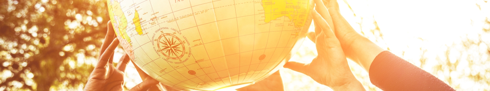
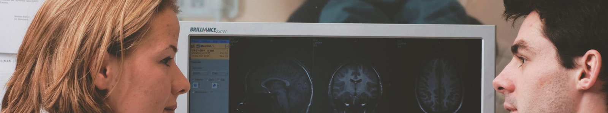
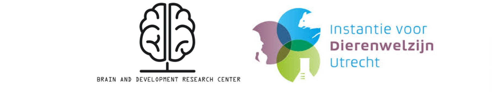
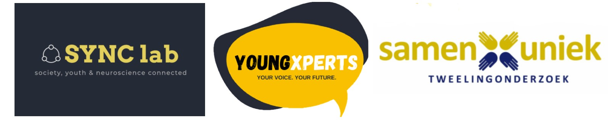

<html>

  <head>
        <meta name="viewport" content="width-device-width, initial-scale=1">

        <style>
​      img{border-radius: 50%;}

```html
* {
  box-sizing: border-box;
}
    /* Create two equal columns that float next to each other /
    .column {
    float: left;
    width: 50%;
    padding: 5px;
    }
    /* Clear floats after the columns */
    .row:after {
        content: "";
        display: table;
        clear: both;
    }
```

​    </style>

  </head>

<body>

<p></p>

<p> I started my career at Utrecht University in the bachelor <a href="https://www.uu.nl/bachelors/liberal-arts-and-sciences">Liberal Arts and Sciences</a>). Here, I learned about the importance of <b>interdisciplinary cooperation</b> as a way to solve society's larger issues. Besides learning tools for integrating multiple perspectives, I dove into <b>Cognitive and neurobiological psychology</b> (major) and <b>Language development</b> (minor).</p>

<p></p>
<p>With my newly acquired knowledge, I applied for the master <a href="https://www.uu.nl/masters/en/neuroscience-and-cognition">Neuroscience and Cognition</a>. During my master's, I conducted two <b>research projects</b> in both cognitive (9 months) and developmental psychology (6 months). Additionally, I decided to extend my master with a minor in <b>science education and communication</b>, where I gained skills in communicating science to different audiences.</p>

<p></p>
<p>After my master's, I started as <b>data manager</b> at the Brain and Development Research Center ánd as <b>educational content creator</b> and e-moderator at University Medical Center Utrecht (UMC). In these positions, I was able to combine promoting good research practices with creating educational scientific content for a PhD audience.</p>

<p></p>
<p>Currently, I work as a research assistant at Erasmus University Rotterdam (<a href="https://www.eur.nl/people/dorien-huijser">EUR</a>) and Leiden University <a href="https://www.universiteitleiden.nl/en/staffmembers/dorien-huijser">LU</a>)). My job includes:
     <ul>
    <li><strong>Data management</strong> (EUR and LU): I formulate ways to move towards <strong>open science practices</strong> in the <a href="http://erasmus-synclab.nl/">SYNC lab</a> (Society, Youth and Neuroscience Connected at EUR) and in the Leiden Consortium on Individual Development (L-CID, LU) project. As a prerequisite for open science practices, I also look at how we handle our research data (privacy, data structure, long-term access, etc.) and how we can improve that. In both areas, I try to educate myself as much as possible and keep a close eye on international developments, connecting with researchers and support staff from national and international institutions.</li>
<li><strong>Lab management</strong> and support (EUR): I help researchers with figuring out scientific procedures, organizing labmeetings, keeping notes, communicating with EUR's research support staff, thinking about how we can improve how we work, etc. Additionally, I also play a role in setting up our citizen science platform, <a href="https://youngxperts.nl">"YoungXperts"</a>, where youth are actively involved in our research during brainstorms and cocreation sessions.</li>
</ul></p>


<p>Read more on what I do now <a href="../what-i-do">here</a>.</p>


 <h2> What I find important</h2>

```
<p>
  <ul> 
  <li>Transparency</li>
  <li>Honesty</li>
  <li>No-nonsense</li>
  <li>Progress</li>
  <li>Societal impact</li>
  <li>Education</li>
  <li>Helping others</li>
  <li>Science in society</li>
  <li>Collaboration</li>
  </ul>
</p>
```

<br>


<p style="text-align:center;"><a class="twitter-timeline" data-lang="en" data-width="250" data-height="350" data-theme="light" href="https://twitter.com/DorienHuijser?ref_src=twsrc%5Etfw">Tweets by DorienHuijser</a> <script async src="https://platform.twitter.com/widgets.js" charset="utf-8"></script></p>


</body>  

</html>