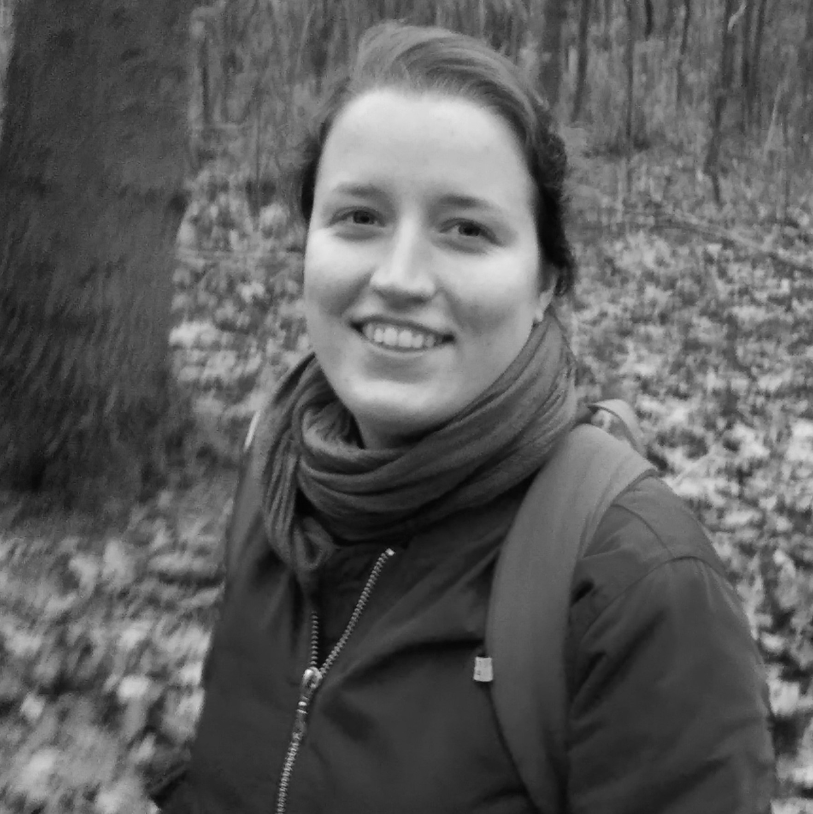
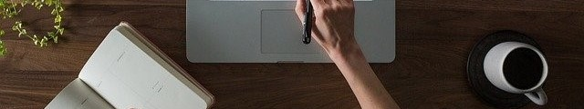

---
#
# Use the widgets beneath and the content will be
# inserted automagically in the webpage. To make
# this work, you have to use › layout: frontpage
#
layout: frontpage
meta_title: "Home | Dorien Huijser"
header:
  title: "Dorien Huijser"
  image_fullwidth: home.jpg
widget1:
  title: "What I do"
  url: "/what-i-do/"
  image: bridgesq.jpg
  text: "Read more about what I do."
widget2:
  title: "Testimonials"
  url: "/testimonials/"
  text: "Who better to say stuff about me than... <em>not me</em>? Read what others say about me on this page."
  image: talkingsq.jpg
widget3:
  title: "CV"
  url: "/cv/"
  image: nov2020_squarebw2.jpg
  text: "Checkout all my qualifications and work experience here."
# Use the call for action to show a button on the frontpage
# To style the button in different colors, use no value
# to use the main color or success, alert or secondary.
# To change colors see sass/_01_settings_colors.scss
#
callforaction:
  url: /contact/
  text: Get in touch
  style: alert
permalink: /index.html
#
# This is a nasty hack to make the navigation highlight
# this page as active in the topbar navigation
#
homepage: true
---

<html>

    <head>
        <meta name="viewport" content="width-device-width, initial-scale=1">
        </head>

<body>

 

<figure style="border:0px #cccccc solid; padding:0px; margin:auto;text-align:center"></figure>

 

<h1 style="text-align:center">
Welcome!
</h1>

You have landed on my personal website!   Here, you can read more about me and what I do. 

 

<button type="button" class="collapsible"><b>Bio</b></button>

    

  
  
<h3 style="color:white">Studies</h3>

I started my career at Utrecht University in the bachelor <a href="https://www.uu.nl/bachelors/liberal-arts-and-sciences">Liberal Arts and Sciences</a>. Here, I learned about the importance of <b>interdisciplinary cooperation</b> as a way to solve society's larger issues. Additionally, I dove into <b>Cognitive and neurobiological psychology</b> (major) and <b>Language development</b> (minor).

    
In my master <a href="https://www.uu.nl/masters/en/neuroscience-and-cognition">Neuroscience and Cognition</a>, I conducted two <b>research projects</b> in both cognitive (9 months) and developmental psychology (6 months). Additionally, I completed a minor in <b>science education and communication</b>, where I gained skills in communicating science to different audiences.

    

  
  
<h3 style="color:white">Work</h3>

After my master's, I started as educational content creator and e-moderator at UMC Utrecht, and as a data manager at the Brain and Development Research Center. In these positions, I was able to combine promoting good research practices with creating educational scientific content for a PhD audience. Later, I continued my job as a data manager at the same developmental neuroscience group at Erasmus University Rotterdam and Leiden University.

Currently, I work as a data steward at the Utrecht University Library. In this position, I help researchers with their research data management questions and issues. Check out the <a href="../what-i-do">What I do page</a> for more info.

</body>

</html>
