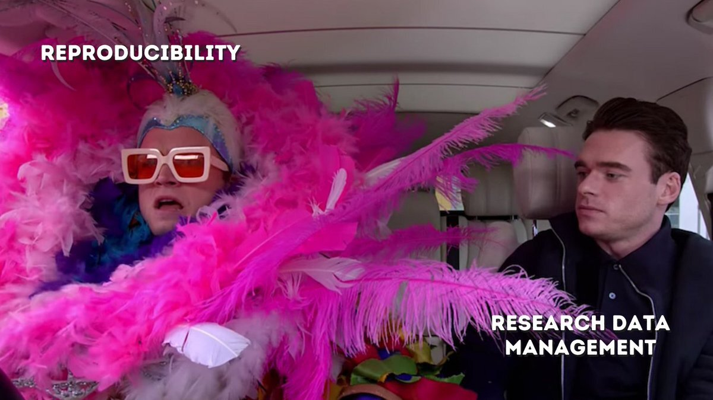
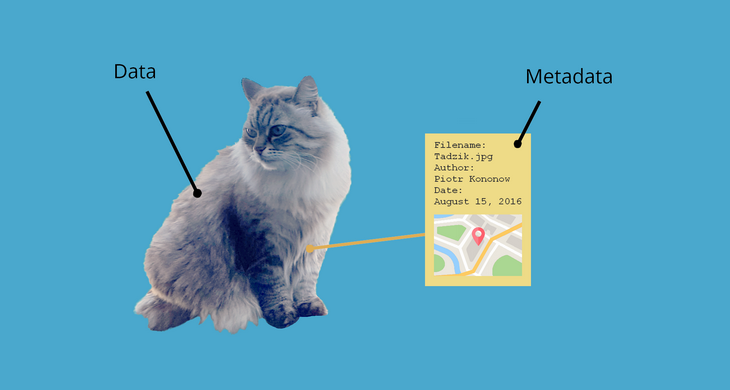

*Source: <https://twitter.com/hlrdmp/status/1357368172568076288>*

One of the goals of open science is to make science more transparent. There are many ways to do so, but one of the most prominent ones is to share research data, allowing others to check scientific results or to perform new research. But when are data – and accompanying materials – useful?

## FAIR enough?

At the moment, there are many degrees of practicing open science. Whereas some researchers simply share nothing, others throw their data somewhere on the internet and yet another small portion uses hardcore curation. The latter is the ultimate goal: data and code should be Findable, Accessible, Interoperable and Reusable (<b><a href="https://www.youtube.com/watch?v=2uZxFu9SFi8" target="_blank">FAIR</a></b>). Despite this relatively simple sounding acronym, actually meeting the requirements of FAIR in practice turns out to be quite difficult.

No one should expect researchers to be able to do _everything_ in the context of scientific research. This is where research supporters come in. Data stewards know a lot about research data management, because that is what they do! For example, they know how to deal with privacy sensitive data and how to anonymize them. They know how you can make sure to never lose previous versions of your files ever again. Perhaps most important for open science however: they know what is needed to make data FAIR. Although this all seems like boring stuff – _which it sometimes is_ – it is crucial on the long term.

## The crucial cat concept

Take metadata. If you share only your data, no one will be able to use them. Why? Because just the data alone do not tell you anything about the kind of data, the participants, what was measured and how. Others, including your future self, may not have a clue what the variable “var1” means in column X of your dataset. Metadata is here to provide this context. If we think of data as a picture of a cat, metadata is the date the picture was taken, the location, which camera made the picture and the file size, among others. You can take this very far at different levels, but I will not bore you with that. My point is that this requires consideration, because metadata are a prerequisite for the <a href="https://www.youtube.com/watch?v=66oNv_DJuPc" target="_blank">reuse of your data</a>.

## Forever accessible

Another example concerns persistent identifiers. You may think: _why can’t I just send my data to whomever interested?_ Or: _Why can’t I just put my data on my personal website?_ However, this can lead to problems. Even though (no doubt!) your intentions are good, what if you leave your job and cannot access your 2008 data anymore? Or if you decide to use a different domain name for your website? In the latter case, all of the links to the data you put in your scientific article or that were sent to colleagues become invalid. <b><a href="https://www.youtube.com/watch?v=PgqtiY7oZ6k&feature=emb_title" target="_blank">Persistent identifiers</a></b> are here to save the day, and research supporters play a crucial role in pointing researchers at these issues (you’re welcome).

By now, I hope that you agree with me that research data management is an important prerequisite for pushing open science forward. A solid basis of research data management will not only make science transparent, but also sustainable and reproducible in the long run. Luckily, more and more institutions see this and hire data stewards to help researchers achieve this. The science show must go on, but that is not possible without research data management as the secret star of the show.

#### Images

- <a href="https://twitter.com/hlrdmp/status/1357368172568076288" target="_blank">Header image</a>
- <a href="https://dataedo.com/kb/data-glossary/what-is-metadata" target="_blank">Metadata cat</a>

<i>This blog was originally posted on the <a href="https://erasmus-synclab.nl/why-research-data-management-is-critical-for-open-science/" target="_blank">Erasmus SYNC lab website</a></i>
